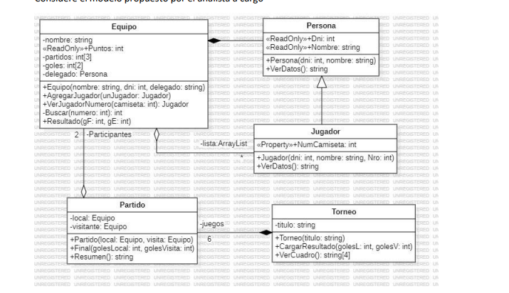
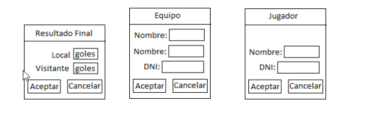

## Club Altos Verdes Agregación y Composición

El club deportivo Altos Verdes necesita una aplicación visual para gestionar un torneo de Hockey donde
participan 4 equipos (cuadrangular)
Considere que un partido se puede ganar sumando 3 puntos, empatar sumando 1 punto o perder sumando
0 puntos.
Se deben registrar los goles también para el caso de tener que desempatar al finalizar el torneo
Considere el modelo propuesto por el analista a cargo

Agregue el atributo Static int idNumero=1 para generar los números de camiseta automáticamente
Considere las siguientes ventadas modales para resolver el problema:

